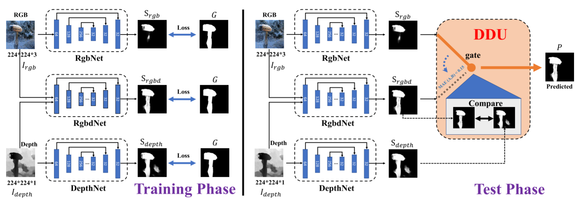

# Resaltado de objetos RGB-D
Este respositorio tiene como finalidad el resaltado de imagenes RGB-D.

#Modelo usado
Esta basado en: "Rethinking RGB-D Salient Object Detection: Models, Data Sets, and Large-Scale Benchmarks, IEEE TNNLS 2021."
Referirse a si página (http://dpfan.net/d3netbenchmark/) para más detalles. 

<p align="center">
     <br/>
    <em> 
Figura 1: Modelo de la red de entramiento, referirse a su propio paper para más detalles.
    </em>
</p>

## Bases de datos
Base de datos usados para el entrenamiento:

https://drive.google.com/open?id=1osdm_PRnupIkM82hFbz9u0EKJC_arlQI

Base de datos de prueba:

https://drive.google.com/open?id=1ABYxq0mL4lPq2F0paNJ7-5T9ST6XVHl1

Base de datos propios ya incluidos (tal vez se actualice).

Modelos entrenados. (requiere cuenta @unsa.edu.pe)
https://drive.google.com/drive/folders/15Q1cD3Dd8LAAs-Rwn1Oriu-tqomeIBWZ?usp=sharing

## Requerimientos
Basado en la última ejecución estable.
- Python>=9.9
- PyTorch>=1.10.1+cu113
- Opencv>=4.5.4


## Entramiento:
Se pusieron las bases de datos 'NJU2K_TRAIN', 'NLPR_TRAIN','NJU2K_TEST' en la carpeta "dataset".

Tambien se utilizó el modelo pre-entranado 'vgg16_feat.pth' ( [GoogleDrive](https://drive.google.com/file/d/1SXOV-DKnnqFD_b9yxJCIzdSkU7qiHh1X/view?usp=sharing) | [BaiduYun](https://pan.baidu.com/s/17qaLM3nbgR_eGehSK-SOrA) code: zsxh )  into the created folder "model".
```
python train.py --net RgbNet
python train.py --net RgbdNet
python train.py --net DepthNet
```

## Evaluacion:
Se pusieron los modelos entrenados en la carpeta "eval/pretrained_model".
```
python eval.py
```

##Ejecucion con la base de datos propia
La base de datos propia no contiene una carpeta GT. Para ver los resultados de solo ejecutar los modelos:
```
python test.py
```

## Pretrained models
-RgbdNet,RgbNet,DepthNet pretrained models can be downloaded from ( [GoogleDrive](https://drive.google.com/drive/folders/1jbZzUbgOC0XzbBEsy-Bgf3b-pvr62aWK?usp=sharing) | [BaiduYun](https://pan.baidu.com/s/1sgi0KExOv5KOfGQgXpDdqw) code: xf1h )  

## Resultados
Los resultados se pueden observar en la carpeta "eval/result/D3Net/LR"

## Referencias
Este es un derivado del trabajo original, de ser util referencias a ellos.
```
@article{fan2019rethinking,
  title={{Rethinking RGB-D salient object detection: Models, datasets, and large-scale benchmarks}},
  author={Fan, Deng-Ping and Lin, Zheng and Zhang, Zhao and Zhu, Menglong and Cheng, Ming-Ming},
  journal={IEEE TNNLS},
  year={2021}
}
@article{zhou2021rgbd,
  title={RGB-D Salient Object Detection: A Survey},
  author={Zhou, Tao and Fan, Deng-Ping and Cheng, Ming-Ming and Shen, Jianbing and Shao, Ling},
  journal={CVMJ},
  year={2021}
}
```
